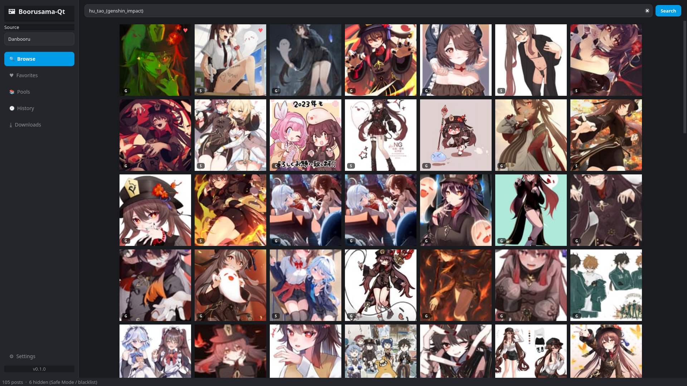

# Boorusama-Qt

A desktop reimplementation of [Boorusama](https://github.com/khoadng/Boorusama)
(the Flutter booru client) built with **Qt for Python (PySide6)** instead of
Flutter/Dart.

It's a multi-backend image-board browser with a pluggable engine architecture:
adding a new booru is a single module (or, for many sites, just a config
profile).



## Features

- 🔌 **Pluggable engines** — Danbooru, Gelbooru, and a config-driven *generic*
  engine (moebooru/philomena profiles, e.g. yande.re, Konachan). Add more by
  dropping a module into `boorusama/engines/`.
- 🔍 **Search** with per-token **tag autocomplete** (category-colored).
- 🖼 **Responsive thumbnail grid** with infinite scroll and a two-tier
  (memory + disk) image cache.
- 🔎 **Full post viewer** — large image, category-grouped clickable tags,
  metadata, prev/next navigation (arrow keys), favorite (`F`), download.
- ♥ **Local favorites** and **search history** (SQLite-backed).
- 📚 **Pools** browsing (where the backend supports it, e.g. Danbooru).
- ⤓ **Download manager** with live progress.
- 🚫 **Blacklist** (Danbooru-style AND/OR rules) and a **safe-mode** toggle.
- 🎨 **Theming** — dark / light / midnight palettes with a custom accent color.
- 👤 **Per-source login** (API keys) for sites that require/benefit from it.

## Install & run

Requires Python 3.11+ (PySide6 6.6+ is pulled in automatically).

### From a release package

Grab the wheel from the [latest release](https://github.com/1Git2Clone/boorusama-qt/releases/latest), then:

```bash
# with uv (recommended) — installs an isolated `boorusama-qt` command
uv tool install ./boorusama_qt-0.1.0-py3-none-any.whl
boorusama-qt

# …or into an environment with pip
pip install ./boorusama_qt-0.1.0-py3-none-any.whl
boorusama-qt
```

### From source

```bash
git clone https://github.com/1Git2Clone/boorusama-qt
cd boorusama-qt

# with uv
uv run python main.py

# …or a classic venv
python -m venv .venv && source .venv/bin/activate
pip install -r requirements.txt
python main.py
```

### Build the packages yourself

```bash
uv build          # → dist/boorusama_qt-*.whl and *.tar.gz
```

## Architecture

```
boorusama/
├── core/                  backend-agnostic foundation
│   ├── models.py          Post, Tag, Pool, Rating, Account dataclasses
│   ├── engine.py          BooruEngine ABC + capabilities/config
│   ├── registry.py        engine registration & instantiation
│   ├── workers.py         QThreadPool helpers (run_async)
│   └── imageloader.py     async image fetch + mem/disk cache
├── engines/               one module per backend family
│   ├── danbooru.py
│   ├── gelbooru.py
│   └── generic.py         config-driven (moebooru / philomena profiles)
├── services/              local features
│   ├── storage.py         SQLite favorites + history
│   ├── blacklist.py       tag/rating filtering
│   └── downloads.py       streaming download manager
├── ui/                    PySide6 widgets & windows
│   ├── main_window.py     nav rail, source switcher, content stack
│   ├── search_bar.py      debounced autocomplete
│   ├── post_grid.py       infinite-scroll grid
│   ├── post_viewer.py     full viewer + tag/metadata panel
│   ├── pages.py           favorites / history / downloads / pools
│   ├── settings_dialog.py sources, login, appearance, content filters
│   ├── widgets.py         FlowLayout, TagChip, PostThumbnail
│   └── theme.py           QSS palettes
├── config.py              JSON settings + source definitions + paths
├── context.py             central AppContext wiring everything together
└── app.py                 QApplication bootstrap
```

### Adding a new booru

For Danbooru/moebooru/Gelbooru-shaped JSON APIs, add a profile to
`PROFILES` in `engines/generic.py` and a default `SourceConfig` in
`config.py`. For anything bespoke, subclass `BooruEngine`, implement
`search_posts` (and optionally `autocomplete_tags`, `search_pools`, …), and
decorate it with `@register_engine`.

## Notes on backends

- **Danbooru** — fully supported (search, autocomplete, pools, login,
  per-category tags).
- **yande.re / Konachan** — work out of the box via the generic `moebooru`
  profile.
- **Gelbooru** — now requires an API key (`user_id` + `api_key`) for its JSON
  API even for reads. Add credentials under **Settings → Sources & Login**;
  errors otherwise surface in the status bar.

## Keyboard & mouse

In the post viewer:

| Key            | Action            |
|----------------|-------------------|
| `←` / `→`      | Previous / next post |
| `F`            | Toggle favorite   |
| `Esc`          | Back to grid      |

Browser-style history (anywhere) — moves through searches, pools, opened posts,
and sidebar pages:

| Input                          | Action  |
|--------------------------------|---------|
| Mouse Back (button 4) / `Alt`+`←` | Back    |
| Mouse Forward (button 5) / `Alt`+`→` | Forward |

## Status

This is a faithful but from-scratch port focused on the core Boorusama loop and
the major feature surfaces. It is not affiliated with the original project.

## License

Released under the **GNU General Public License v3.0 or later** — see
[`LICENSE`](LICENSE).
